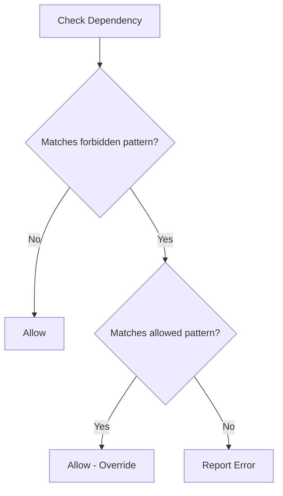

# Dependency Constraints Rule

> **⚠️ DEPRECATED:** This rule has been renamed to `ForbiddenDependenciesRule`. The `DependencyConstraintsRule` class is kept for backward compatibility but will be removed in a future major version. Please update your configuration to use `ForbiddenDependenciesRule` instead.

Enforces dependency constraints between namespaces by checking `use` statements and optionally fully qualified class names (FQCNs).

The constructor takes an array of namespace dependencies. The key is the namespace that should not depend on the namespaces in the array of values.

In the example below nothing from `App\Domain` can depend on anything from `App\Controller`.

## Configuration Example

### Basic Usage (Use Statements Only)

**Recommended (using new class name):**

```neon
    -
        class: Phauthentic\PHPStanRules\Architecture\ForbiddenDependenciesRule
        arguments:
            forbiddenDependencies: [
                '/^App\\Domain(?:\\\w+)*$/': ['/^App\\Controller\\/']
            ]
        tags:
            - phpstan.rules.rule
```

**Deprecated (backward compatibility):**

```neon
    -
        class: Phauthentic\PHPStanRules\Architecture\DependencyConstraintsRule
        arguments:
            forbiddenDependencies: [
                '/^App\\Domain(?:\\\w+)*$/': ['/^App\\Controller\\/']
            ]
        tags:
            - phpstan.rules.rule
```

### With FQCN Checking Enabled

**Recommended (using new class name):**

```neon
    -
        class: Phauthentic\PHPStanRules\Architecture\ForbiddenDependenciesRule
        arguments:
            forbiddenDependencies: [
                '/^App\\Capability(?:\\\w+)*$/': [
                    '/^DateTime$/',
                    '/^DateTimeImmutable$/'
                ]
            ]
            checkFqcn: true
        tags:
            - phpstan.rules.rule
```

### With Selective Reference Types

**Recommended (using new class name):**

```neon
    -
        class: Phauthentic\PHPStanRules\Architecture\ForbiddenDependenciesRule
        arguments:
            forbiddenDependencies: [
                '/^App\\Capability(?:\\\w+)*$/': [
                    '/^DateTime$/',
                    '/^DateTimeImmutable$/'
                ]
            ]
            checkFqcn: true
            fqcnReferenceTypes: ['new', 'param', 'return', 'property']
        tags:
            - phpstan.rules.rule
```

## Parameters

- `forbiddenDependencies`: Array where keys are namespace patterns that should not depend on the namespace patterns in their value arrays.
- `checkFqcn` (optional, default: `false`): Enable checking of fully qualified class names in addition to use statements.
- `fqcnReferenceTypes` (optional, default: all types): Array of reference types to check when `checkFqcn` is enabled.
- `allowedDependencies` (optional, default: `[]`): Whitelist that overrides forbidden dependencies. If a dependency matches both a forbidden pattern and an allowed pattern, it will be allowed.

## FQCN Reference Types

When `checkFqcn` is enabled, the following reference types can be checked:

- `new` - Class instantiations (e.g., `new \DateTime()`)
- `param` - Parameter type hints (e.g., `function foo(\DateTime $date)`)
- `return` - Return type hints (e.g., `function foo(): \DateTime`)
- `property` - Property type hints (e.g., `private \DateTime $date`)
- `static_call` - Static method calls (e.g., `\DateTime::createFromFormat()`)
- `static_property` - Static property access (e.g., `\DateTime::ATOM`)
- `class_const` - Class constant (e.g., `\DateTime::class`)
- `instanceof` - instanceof checks (e.g., `$x instanceof \DateTime`)
- `catch` - catch blocks (e.g., `catch (\Exception $e)`)
- `extends` - class inheritance (e.g., `class Foo extends \DateTime`)
- `implements` - interface implementation (e.g., `class Foo implements \DateTimeInterface`)

## Use Cases

### Preventing DateTime Usage in Domain Layer

This example prevents usage of PHP's built-in `DateTime` and `DateTimeImmutable` classes in your capability layer, encouraging the use of domain-specific date/time objects:

```neon
    -
        class: Phauthentic\PHPStanRules\Architecture\ForbiddenDependenciesRule
        arguments:
            forbiddenDependencies: [
                '/^App\\Capability(?:\\\w+)*$/': [
                    '/^DateTime$/',
                    '/^DateTimeImmutable$/'
                ]
            ]
            checkFqcn: true
        tags:
            - phpstan.rules.rule
```

This will catch:
- `use DateTime;` (use statement)
- `new \DateTime()` (instantiation)
- `function foo(\DateTime $date)` (parameter type)
- `function bar(): \DateTime` (return type)
- `private \DateTime $date` (property type)
- And all other reference types listed above

### Selective Checking for Performance

If you only want to check specific reference types (e.g., to improve performance or focus on certain usage patterns):

```neon
    -
        class: Phauthentic\PHPStanRules\Architecture\ForbiddenDependenciesRule
        arguments:
            forbiddenDependencies: [
                '/^App\\Capability(?:\\\w+)*$/': [
                    '/^DateTime$/'
                ]
            ]
            checkFqcn: true
            fqcnReferenceTypes: ['new', 'return']  # Only check instantiations and return types
        tags:
            - phpstan.rules.rule
```

### Whitelist with allowedDependencies

The `allowedDependencies` parameter lets you create a "forbid everything except X" pattern without complex regex. Dependencies matching both forbidden and allowed patterns will be allowed.

This example forbids all third-party/namespaced dependencies in the domain layer, except for `App\Shared`, `App\Capability`, and `Psr\*`:

```neon
    -
        class: Phauthentic\PHPStanRules\Architecture\ForbiddenDependenciesRule
        arguments:
            forbiddenDependencies: [
                '/^App\\Capability\\.*\\Domain$/': [
                    '/.*\\\\.*/'  # Match anything with a backslash (namespaced)
                ]
            ]
            checkFqcn: true
            allowedDependencies: [
                '/^App\\Capability\\.*\\Domain$/': [
                    '/^App\\Shared\\/',
                    '/^App\\Capability\\/',
                    '/^Psr\\/'
                ]
            ]
        tags:
            - phpstan.rules.rule
```

This will:

- **Allow**: `App\Shared\ValueObject\Money`, `App\Capability\Billing\Invoice`, `Psr\Log\LoggerInterface`
- **Forbid**: `Doctrine\ORM\EntityManager`, `Symfony\Component\HttpFoundation\Request`

Note: Root namespace classes (like `DateTime`, `Exception`) are not matched by the `/.*\\\\.*/'` pattern since they don't contain a backslash, so they are implicitly allowed.

## Diagram



## Backward Compatibility

By default, `checkFqcn` is `false` and `allowedDependencies` is empty, so existing configurations will continue to work exactly as before, checking only `use` statements. The new FQCN checking and allowedDependencies features must be explicitly enabled.
