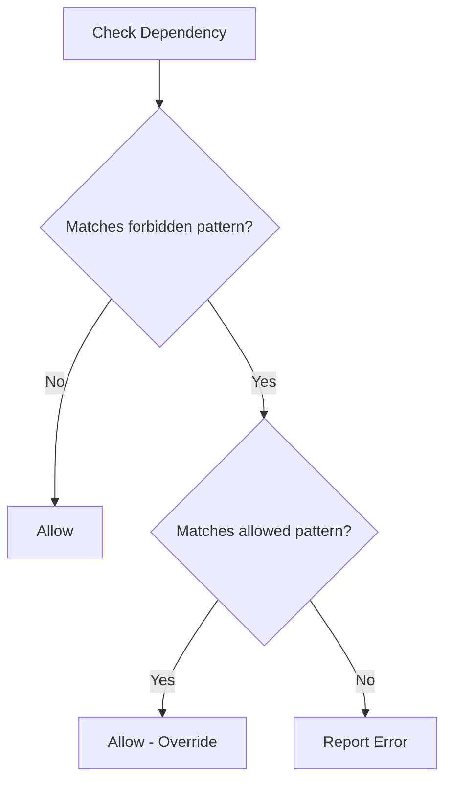

# Forbidden Dependencies Rule

Enforces dependency constraints between namespaces by checking `use` statements and optionally fully qualified class names (FQCNs). This rule prevents classes in one namespace from depending on classes in another, helping enforce architectural boundaries like layer separation.

> **Note:** This rule replaces the deprecated `DependencyConstraintsRule`. See [Dependency Constraints Rule](Dependency-Constraints-Rule.md) for migration details.

## Configuration Example

### Basic Usage (Use Statements Only)

```neon
    -
        class: Phauthentic\PHPStanRules\Architecture\ForbiddenDependenciesRule
        arguments:
            forbiddenDependencies: [
                '/^App\\Domain(?:\\\w+)*$/': ['/^App\\Controller\\/']
            ]
        tags:
            - phpstan.rules.rule
```

### With FQCN Checking Enabled

```neon
    -
        class: Phauthentic\PHPStanRules\Architecture\ForbiddenDependenciesRule
        arguments:
            forbiddenDependencies: [
                '/^App\\Capability(?:\\\w+)*$/': [
                    '/^DateTime$/',
                    '/^DateTimeImmutable$/'
                ]
            ]
            checkFqcn: true
        tags:
            - phpstan.rules.rule
```

### With Selective Reference Types

```neon
    -
        class: Phauthentic\PHPStanRules\Architecture\ForbiddenDependenciesRule
        arguments:
            forbiddenDependencies: [
                '/^App\\Capability(?:\\\w+)*$/': [
                    '/^DateTime$/',
                    '/^DateTimeImmutable$/'
                ]
            ]
            checkFqcn: true
            fqcnReferenceTypes: ['new', 'param', 'return', 'property']
        tags:
            - phpstan.rules.rule
```

## Parameters

- `forbiddenDependencies`: Array where keys are regex patterns for source namespaces and values are arrays of regex patterns for disallowed dependency namespaces.
- `checkFqcn` (optional, default: `false`): Enable checking of fully qualified class names in addition to use statements.
- `fqcnReferenceTypes` (optional, default: all types): Array of reference types to check when `checkFqcn` is enabled.
- `allowedDependencies` (optional, default: `[]`): Whitelist that overrides forbidden dependencies. If a dependency matches both a forbidden pattern and an allowed pattern, it will be allowed.

## FQCN Reference Types

When `checkFqcn` is enabled, the following reference types can be checked:

- `new` - Class instantiations (e.g., `new \DateTime()`)
- `param` - Parameter type hints (e.g., `function foo(\DateTime $date)`)
- `return` - Return type hints (e.g., `function foo(): \DateTime`)
- `property` - Property type hints (e.g., `private \DateTime $date`)
- `static_call` - Static method calls (e.g., `\DateTime::createFromFormat()`)
- `static_property` - Static property access (e.g., `\DateTime::ATOM`)
- `class_const` - Class constant (e.g., `\DateTime::class`)
- `instanceof` - instanceof checks (e.g., `$x instanceof \DateTime`)
- `catch` - catch blocks (e.g., `catch (\Exception $e)`)
- `extends` - class inheritance (e.g., `class Foo extends \DateTime`)
- `implements` - interface implementation (e.g., `class Foo implements \DateTimeInterface`)

## Use Cases

### Enforcing Layer Boundaries

Prevent domain classes from depending on infrastructure or presentation layers:

```neon
    -
        class: Phauthentic\PHPStanRules\Architecture\ForbiddenDependenciesRule
        arguments:
            forbiddenDependencies:
                '/^App\\Capability\\.*\\Domain/':
                    - '/^App\\Capability\\.*\\Application/'
                    - '/^App\\Capability\\.*\\Infrastructure/'
                    - '/^App\\Capability\\.*\\Presentation/'
                '/^App\\Capability\\.*\\Application/':
                    - '/^App\\Capability\\.*\\Infrastructure/'
                    - '/^App\\Capability\\.*\\Presentation/'
        tags:
            - phpstan.rules.rule
```

### Preventing DateTime Usage in Domain Layer

Encourage the use of domain-specific date/time objects instead of PHP's built-in classes:

```neon
    -
        class: Phauthentic\PHPStanRules\Architecture\ForbiddenDependenciesRule
        arguments:
            forbiddenDependencies: [
                '/^App\\Capability(?:\\\w+)*$/': [
                    '/^DateTime$/',
                    '/^DateTimeImmutable$/'
                ]
            ]
            checkFqcn: true
        tags:
            - phpstan.rules.rule
```

This will catch:

- `use DateTime;` (use statement)
- `new \DateTime()` (instantiation)
- `function foo(\DateTime $date)` (parameter type)
- `function bar(): \DateTime` (return type)
- `private \DateTime $date` (property type)
- And all other reference types listed above

### Whitelist with allowedDependencies

The `allowedDependencies` parameter lets you create a "forbid everything except X" pattern. Dependencies matching both forbidden and allowed patterns will be allowed.

```neon
    -
        class: Phauthentic\PHPStanRules\Architecture\ForbiddenDependenciesRule
        arguments:
            forbiddenDependencies: [
                '/^App\\Capability\\.*\\Domain$/': [
                    '/.*\\\\.*/'
                ]
            ]
            checkFqcn: true
            allowedDependencies: [
                '/^App\\Capability\\.*\\Domain$/': [
                    '/^App\\Shared\\/',
                    '/^App\\Capability\\/',
                    '/^Psr\\/'
                ]
            ]
        tags:
            - phpstan.rules.rule
```

This will:

- **Allow**: `App\Shared\ValueObject\Money`, `App\Capability\Billing\Invoice`, `Psr\Log\LoggerInterface`
- **Forbid**: `Doctrine\ORM\EntityManager`, `Symfony\Component\HttpFoundation\Request`

## Diagram



## Backward Compatibility

By default, `checkFqcn` is `false` and `allowedDependencies` is empty, so existing configurations will continue to work exactly as before, checking only `use` statements. The new FQCN checking and allowedDependencies features must be explicitly enabled.
